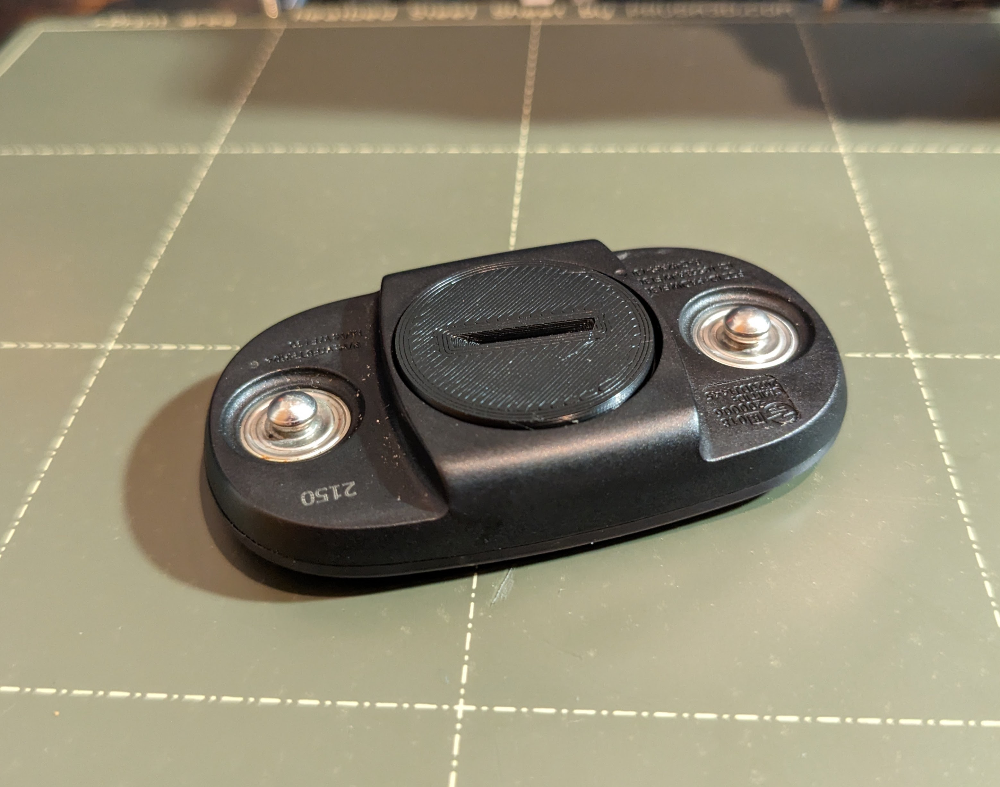

# 3dprinting
Scripts and models for my personal 3d printing projects

# AAABatteryBed
A plate to hold batteries vertically.

# CandyCaneStake
A replacement part for some outdoor decorations.
| Model | Print |
| ------------- | ------------- |
|  |  |

# TreePostTopper
The best part of 3D printing is when you can make a one-off print to fix something that you might have to otherwise throw away.
| Model | Print |
| ------------- | ------------- |
|  |  |

# Wahoo Tickr Batter Cover
I created this model because when I tried to replace the battery in my Wahoo Tickr the cover's pins deformed and snapped. It would no longer seal with only two pins available so I designed this replacement cover for myself. I went through 5 test prints to get a good fit and I'm pleased with it. 
| Model | Print |
| ------------- | ------------- |
|  |  |

